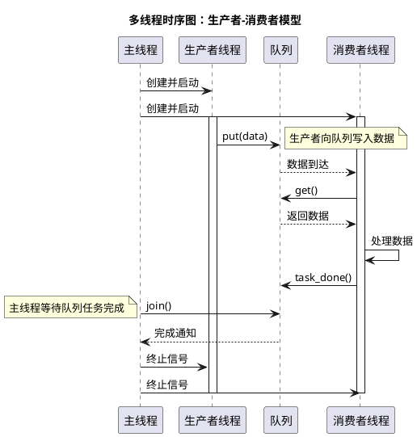
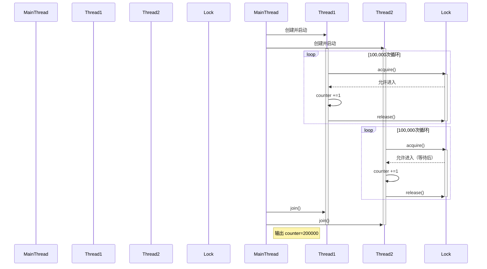
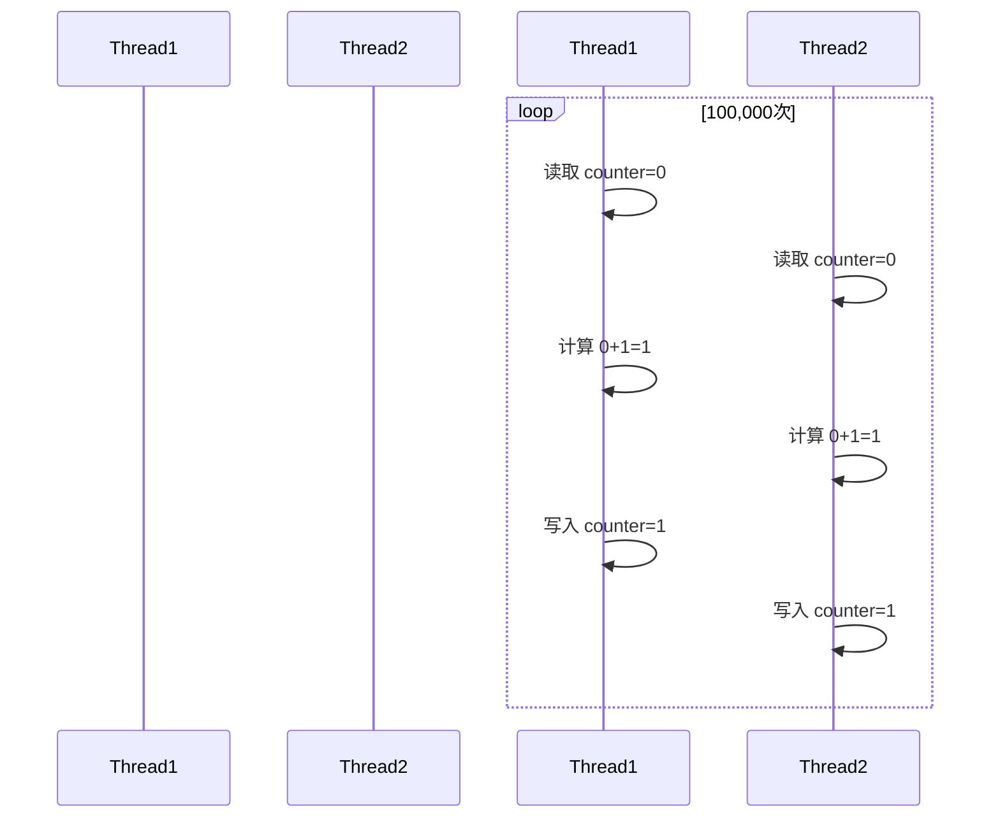
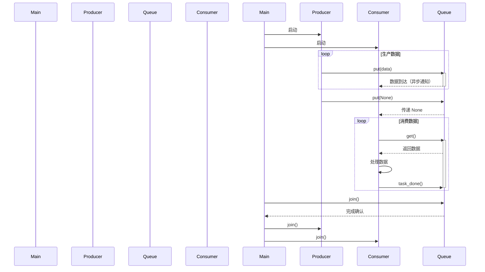
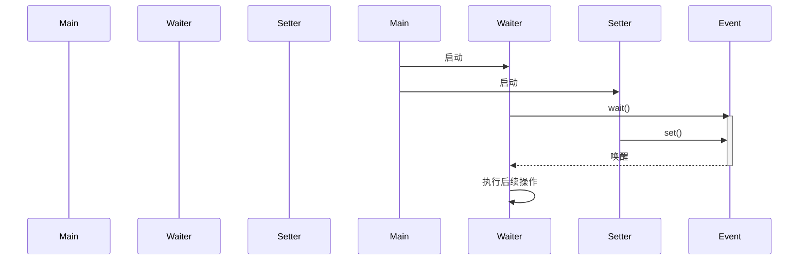
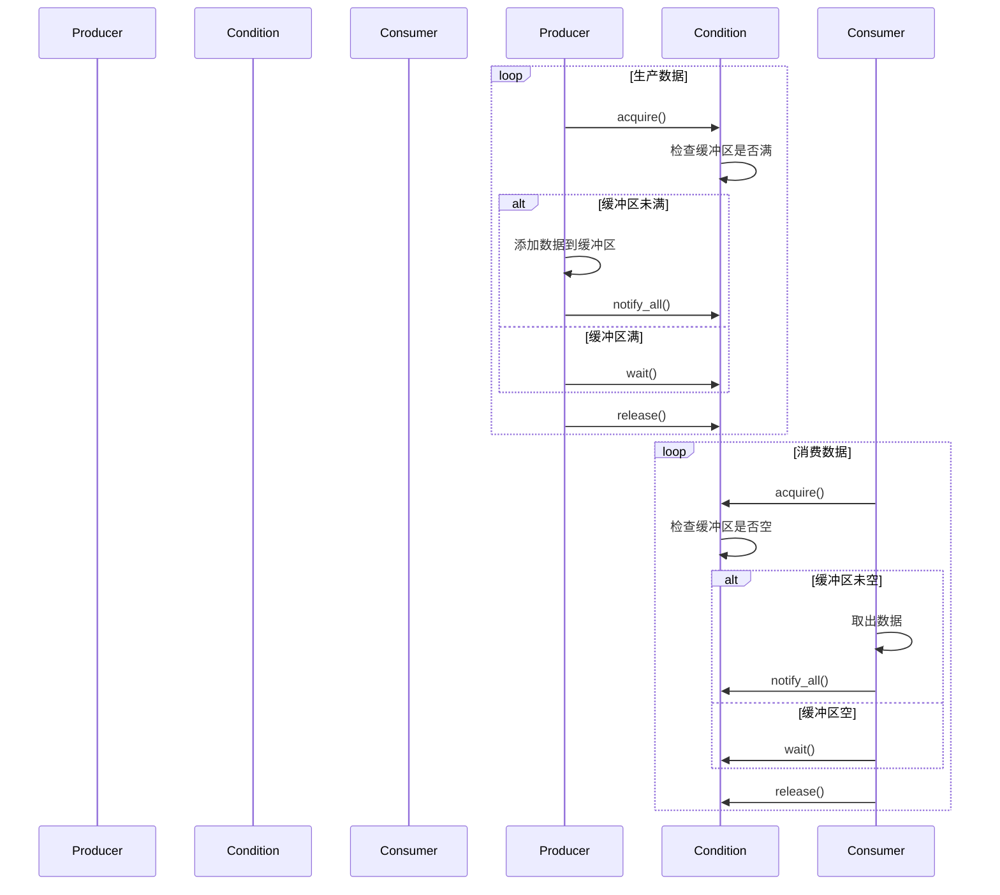
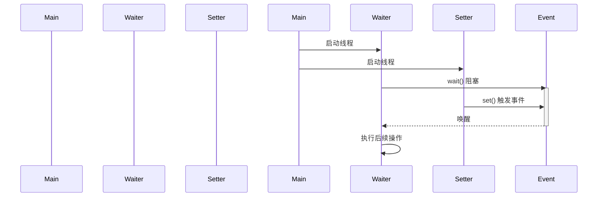
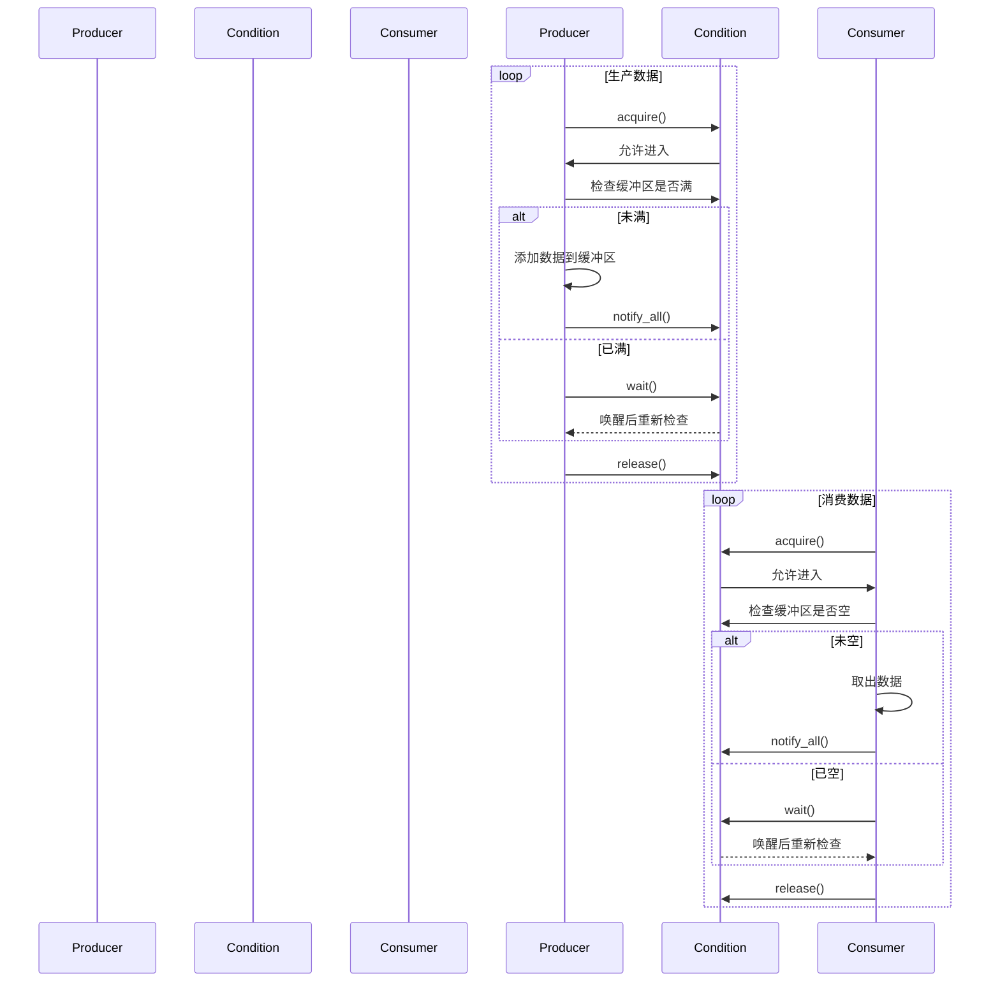

# 查看程序中运行的线程数量
在 Python 中，可以通过 `threading` 模块查看当前程序中活动的线程数量。以下是几种常用的方法：

---

### **方法 1：使用 `threading.active_count()`**
`threading.active_count()` 会返回当前存活的线程数量（包括主线程和其他子线程）。

```python
import threading

def print_active_threads():
    print(f"当前活动线程数量: {threading.active_count()}")

# 示例：创建并启动多个线程
threads = []
for i in range(3):
    thread = threading.Thread(target=lambda: time.sleep(10))
    thread.start()
    threads.append(thread)

print_active_threads()  # 输出：当前活动线程数量: 4（主线程 + 3个子线程）
```

---

### **方法 2：遍历 `threading.enumerate()`**
`threading.enumerate()` 返回所有存活线程的列表，通过列表长度可直接统计线程数：

```python
import threading

def list_all_threads():
    threads = threading.enumerate()
    print(f"总线程数: {len(threads)}")
    for thread in threads:
        print(f"线程名称: {thread.name}, 状态: {'存活' if thread.is_alive() else '终止'}")

# 输出示例：
# 总线程数: 4
# 线程名称: MainThread, 状态: 存活
# 线程名称: Thread-1, 状态: 存活
# 线程名称: Thread-2, 状态: 存活
# 线程名称: Thread-3, 状态: 存活
```

---

### **方法 3：统计非主线程的数量**
如果需排除主线程，可以手动过滤：

```python
import threading

def count_child_threads():
    main_thread = threading.main_thread()
    child_threads = [t for t in threading.enumerate() if t != main_thread and t.is_alive()]
    print(f"子线程数量: {len(child_threads)}")
```

---

### **注意事项**
1. **主线程默认存在**：所有 Python 程序至少有一个主线程（`MainThread`）。
2. **线程状态**：`is_alive()` 用于检查线程是否存活，但 `threading.enumerate()` 默认会过滤已终止的线程。
3. **线程生命周期**：线程可能在 `start()` 后尚未运行，或已运行结束但未被回收，需结合业务逻辑分析。

---

### **动态监控线程数**
若需实时监控，可以在代码中添加定期检查逻辑：
```python
import threading
import time

def monitor_threads(interval=2):
    while True:
        print(f"当前线程数: {threading.active_count()}")
        time.sleep(interval)

# 启动监控线程
monitor_thread = threading.Thread(target=monitor_threads, daemon=True)
monitor_thread.start()
```

---

### **常见场景**
- **调试多线程泄漏**：若线程数持续增长，可能未正确关闭线程。
- **验证并发控制**：确认线程池（如 `concurrent.futures.ThreadPoolExecutor`）是否按预期工作。

通过上述方法，你可以快速定位线程数量是否符合预期，确保程序的高效与稳定。


# 线程知识
在Python中使用线程可以通过内置的`threading`模块实现。线程适合处理**I/O密集型任务**（如网络请求、文件读写等），但由于Python的全局解释器锁（GIL），线程不适用于**CPU密集型任务**（如数学计算）。以下是详细用法：

---

### 一、基础使用
#### 1. 创建并启动线程
```python
import threading
import time

def my_task(name):
    print(f"线程 {name} 启动")
    time.sleep(2)  # 模拟耗时操作
    print(f"线程 {name} 结束")

# 创建线程对象
t1 = threading.Thread(target=my_task, args=("线程1",))
t2 = threading.Thread(target=my_task, args=("线程2",))

# 启动线程
t1.start()
t2.start()

# 等待线程结束
t1.join()
t2.join()

print("所有线程执行完毕")
```

---

### 二、线程同步（防止数据竞争）
#### 使用 `Lock` 锁
```python
counter = 0
lock = threading.Lock()

def increment():
    global counter
    for _ in range(100000):
        with lock:  # 自动获取和释放锁
            counter += 1

t1 = threading.Thread(target=increment)
t2 = threading.Thread(target=increment)

t1.start()
t2.start()
t1.join()
t2.join()

print(f"最终计数: {counter}")  # 正确结果为 200000
```

---

### 三、守护线程（Daemon Threads）
- **守护线程**会在主线程结束时自动退出，适合后台服务。
- 通过`daemon=True`设置：
```python
def daemon_task():
    while True:
        print("守护线程运行中...")
        time.sleep(1)

t = threading.Thread(target=daemon_task, daemon=True)
t.start()

time.sleep(3)
print("主线程结束，守护线程自动终止")
```

---

### 四、线程间通信
#### 使用 `Queue` 安全传递数据
```python
import queue

def producer(q):
    for i in range(5):
        q.put(i)
        print(f"生产数据: {i}")
        time.sleep(0.5)

def consumer(q):
    while True:
        item = q.get()
        if item is None:  # 终止信号
            break
        print(f"消费数据: {item}")
        q.task_done()

q = queue.Queue()
t1 = threading.Thread(target=producer, args=(q,))
t2 = threading.Thread(target=consumer, args=(q,))

t1.start()
t2.start()

t1.join()
q.put(None)  # 发送终止信号
t2.join()
```

---

### 五、线程池（推荐方式）
使用`concurrent.futures`模块简化线程管理：
```python
from concurrent.futures import ThreadPoolExecutor

def task(n):
    return n * n

with ThreadPoolExecutor(max_workers=3) as executor:
    # 提交单个任务
    future = executor.submit(task, 5)
    print(future.result())  # 输出 25

    # 批量提交任务
    results = executor.map(task, [1, 2, 3])
    print(list(results))  # 输出 [1, 4, 9]
```

---

### 六、注意事项
1. **GIL限制**：Python线程因全局解释器锁（GIL）无法并行执行CPU密集型任务，此时应改用`multiprocessing`模块。
2. **避免死锁**：确保锁的获取和释放成对出现，推荐使用`with lock`语法。
3. **线程安全**：对共享资源的操作必须加锁。

如果需要处理CPU密集型任务，建议学习`multiprocessing`模块实现多进程并行。

# 线程锁lock
在 Python 中，`Lock`（锁）是线程同步的核心工具，用于解决**多线程竞争共享资源**导致的数据不一致问题。以下从底层原理到实际用法的全面解析：

---

### 一、Lock 的作用
- **防止数据竞争**：当多个线程同时修改同一共享资源时，可能导致不可预测的结果。Lock 确保同一时间只有一个线程能访问关键代码段（临界区）。
- **保证原子性**：锁住的代码块会作为一个整体执行，不会被其他线程中断。

---

### 二、Lock 的基本使用
#### 1. 手动获取和释放锁
```python
import threading

counter = 0
lock = threading.Lock()  # 创建锁对象

def increment():
    global counter
    for _ in range(100000):
        lock.acquire()  # 获取锁
        counter += 1
        lock.release()  # 释放锁

# 创建并启动线程
t1 = threading.Thread(target=increment)
t2 = threading.Thread(target=increment)
t1.start()
t2.start()
t1.join()
t2.join()

print(counter)  # 正确结果 200000（无锁会导致结果随机小于此值）
```

#### 2. 使用 `with` 语句（推荐）
```python
def increment():
    global counter
    for _ in range(100000):
        with lock:  # 自动获取和释放锁
            counter += 1
```

---

### 三、Lock 的底层机制
1. **二进制信号量**：Lock 本质上是一个二值信号量（0 或 1）。  
   - 当线程调用 `acquire()` 时：
     - 如果锁是“未锁定”状态（值为1），则获取锁并设置为“锁定”状态（值为0）。
     - 如果锁已被其他线程获取（值为0），则当前线程进入阻塞状态，直到锁被释放。
   - `release()` 会将锁恢复为“未锁定”状态，并唤醒等待的线程。

2. **GIL 与 Lock 的关系**：
   - Python 的 GIL（全局解释器锁）确保同一时刻只有一个线程执行字节码。
   - **但 GIL 不保证用户代码的原子性**！例如 `counter += 1` 实际是“读取-修改-写入”三步操作，即使有 GIL，其他线程仍可能在中间插入，因此必须用 Lock。

---

### 四、可重入锁（RLock）
#### 问题场景：同一线程多次获取锁
```python
def func():
    with lock:
        # 再次获取同一个锁（会死锁！）
        with lock:
            print("这行永远不会执行")
```

#### 解决方案：使用 `RLock`
```python
rlock = threading.RLock()  # 可重入锁

def safe_func():
    with rlock:
        with rlock:  # 同一线程可重复获取
            print("正常执行")
```

- **RLock 特性**：
  - 允许同一线程多次获取锁，内部通过计数器实现。
  - 必须保证 `acquire()` 和 `release()` 次数相等才会真正释放。

---

### 五、常见错误及注意事项
#### 1. 死锁（Deadlock）
```python
# 错误示例：两个锁交叉获取
lock1 = threading.Lock()
lock2 = threading.Lock()

def thread_a():
    with lock1:
        with lock2:  # 如果 thread_b 先拿到 lock2，这里会阻塞
            print("A")

def thread_b():
    with lock2:
        with lock1:  # 如果 thread_a 先拿到 lock1，这里会阻塞
            print("B")
```

**解决方案**：
- 按固定顺序获取锁。
- 使用 `lock.acquire(timeout=5)` 设置超时。

#### 2. 忘记释放锁
```python
# 错误示例
lock.acquire()
try:
    # 某些操作...
finally:
    lock.release()  # 必须确保释放！
```

**始终用 `with` 语句代替手动操作**。

---

### 六、锁的适用场景
| 场景                | 是否需要用锁       |
|---------------------|------------------|
| 多线程写共享变量      | ✅ 必须          |
| 多线程读共享变量      | ❌ 不需要        |
| 操作线程安全数据结构（如 `queue.Queue`）| ❌ 不需要       |
| 文件写入            | ✅ 必须          |

---

### 七、性能优化建议
1. **缩小锁的粒度**：只锁住必要的代码，减少锁的持有时间。
   ```python
   # 不推荐
   with lock:
       data = fetch_data()  # 耗时操作
       process(data)

   # 推荐
   data = fetch_data()  # 不涉及共享资源，无需加锁
   with lock:
       process(data)
   ```

2. **避免嵌套锁**：尽量使用单一锁，或按固定顺序获取多个锁。

---

### 总结
- **Lock**：基础锁，适合简单场景。
- **RLock**：解决同一线程重复获取锁的问题（如递归函数）。
- **优先用 `with` 语句**：避免忘记释放锁。
- **死锁预防**：按顺序加锁、设置超时。

理解锁的机制是编写线程安全代码的关键！

## 锁住的代码块会作为一个整体执行，不会被其他线程中断
这句话描述的是锁（如 `threading.Lock`）在多线程编程中的核心作用：**通过锁保护的代码块（临界区）在执行时，其他线程无法进入同一锁保护的代码区域**。这是通过锁的互斥机制实现的，但需要结合 Python 的全局解释器锁（GIL）来理解具体行为。

---

### 具体含义分步解析：
#### 1. **“不会被其他线程中断”的本质**
- 这里的“中断”并非指操作系统层面的线程强制中断，而是指**其他线程无法进入同一锁保护的代码区域**。
- 当一个线程通过 `acquire()` 获取锁后，其他线程尝试获取同一锁时会被阻塞（等待），直到锁被释放。

#### 2. **示例：无锁时的线程切换问题**
假设两个线程同时执行以下代码（无锁）：
```python
counter = 0
def increment():
    global counter
    for _ in range(100000):
        temp = counter  # 步骤1：读取当前值
        temp += 1        # 步骤2：修改值
        counter = temp   # 步骤3：写回新值
```
- **问题**：Python 的线程可能在任何步骤之间被切换（即使有 GIL）。例如：
  1. 线程 A 执行完步骤1（读取 `counter=0`），被切换到线程 B。
  2. 线程 B 读取 `counter=0`，完成所有步骤，将 `counter` 变为1。
  3. 线程 A 恢复执行，继续步骤2和3，最终也写入 `counter=1`。
- **结果**：两次累加操作最终结果却是 `1`（正确应为2），这就是数据竞争。

#### 3. **加锁后的行为**
用锁保护关键代码：
```python
lock = threading.Lock()
def increment():
    global counter
    for _ in range(100000):
        with lock:  # 保证以下3步不可分割
            temp = counter
            temp += 1
            counter = temp
```
- **关键点**：锁内的代码块（`with lock` 下的代码）执行时：
  1. 线程 A 获取锁后，其他线程尝试获取同一锁时会被阻塞。
  2. 即使线程 A 在锁内代码执行时被 GIL 切换（例如执行耗时操作），其他线程也无法进入锁保护的代码块。
  3. 只有当线程 A 释放锁后，其他线程才能继续竞争锁并执行代码。

#### 4. **GIL 与锁的关系**
- **GIL（全局解释器锁）**：确保同一时刻只有一个线程执行 Python 字节码。
- **但 GIL 不足以保证数据安全**：
  - 例如 `counter += 1` 在字节码层面是 `LOAD → ADD → STORE` 多个操作，线程可能在任何两个操作之间被切换。
  - **锁的作用**：在用户代码层面强制将多个操作“粘合”成一个原子操作，即使线程切换发生，其他线程也无法进入同一临界区。

---

### 类比理解
想象一个公共厕所（共享资源）：
1. **无锁**：厕所门开着，多人随时可以进入，可能导致混乱（数据竞争）。
2. **有锁**：厕所门有锁（`Lock`），一个人进入后锁门（`acquire()`），其他人必须等待。只有当他解锁（`release()`）后，下一个人才能进入。

---

### 总结
- **锁保护的代码块**：在多个线程中，同一时刻只有一个线程能执行该代码块。
- **“不可中断”**：指其他线程无法进入同一锁保护的代码区域，而非操作系统层面的执行中断。
- **原子性**：锁内代码的逻辑对外部线程表现为“不可分割”的整体。

- # 一个python程序默认有几个线程
- 在 Python 中，**一个程序默认只有一个主线程**（即运行脚本的线程），但具体数量取决于代码逻辑和使用的库。以下是详细分析：

---

### 一、简单脚本的默认线程数
如果代码中没有手动创建线程，且不依赖任何后台线程的第三方库，程序默认只包含 **1 个主线程**。例如：
```python
# test.py
import threading

print("当前活跃线程数:", threading.active_count())  # 输出 1（仅主线程）
print("主线程名称:", threading.current_thread().name)  # 输出 MainThread
```

---

### 二、可能隐式创建线程的情况
某些情况下，Python 程序会隐式启动其他线程（即使代码未显式创建）：
1. **第三方库的后台线程**：
   - 例如使用 `asyncio` 时，事件循环可能依赖后台线程。
   - 某些网络库（如 `requests` 的特定用法）或 GUI 框架（如 `tkinter`、`PyQt`）可能自动创建线程。
2. **调试工具或 IDE**：
   - 部分开发环境（如 PyCharm）会在调试时附加监控线程。
3. **垃圾回收等内部机制**：
   - Python 解释器本身偶尔会启动临时线程，但通常非常短暂。

---

### 三、手动验证线程数量
可以通过以下代码查看所有活跃线程：
```python
import threading

def print_threads():
    for thread in threading.enumerate():
        print(f"线程名称: {thread.name}, 类型: {type(thread)}")

print_threads()
```

**输出示例**（仅主线程）：
```
线程名称: MainThread, 类型: <class 'threading._MainThread'>
```

---

### 四、典型场景对比
| 场景                 | 线程数 | 说明                         |
|----------------------|-------|------------------------------|
| 纯脚本（无多线程代码） | 1      | 仅主线程                     |
| 显式创建 2 个线程     | 3      | 主线程 + 2 个子线程          |
| 使用 `asyncio`        | 2+     | 主线程 + 事件循环线程        |
| 使用 `multiprocessing`| 1+     | 主线程 + 子进程（进程非线程）|

---

### 五、总结
- **默认情况**：1 个主线程。
- **线程数量可变**：根据代码和依赖库的行为动态变化。
- **调试建议**：若发现意外线程，使用 `threading.enumerate()` 检查来源。

# 构建一个多线程的时序图
以下是基于 Python 多线程场景的**时序图（Sequence Diagram）**构建示例，以 `生产者-消费者模型` 为例，展示线程间的交互流程。使用 [PlantUML](https://plantuml.com/) 语法绘制，你可以用在线工具或 IDE 插件（如 VSCode 的 PlantUML 扩展）渲染成图像。

---

### 一、多线程时序图示例（生产者-消费者模型）


---

### 二、时序图关键元素解析
| 元素                | 说明                                                                 |
|---------------------|--------------------------------------------------------------------|
| **participant**     | 定义参与对象（如线程、队列）                                           |
| **->**              | 同步消息（阻塞操作，如 `put()` 等待队列空间）                           |
| **-->**             | 异步消息（非阻塞操作，如数据到达的通知）                                 |
| **activate**        | 激活线程（线程开始执行）                                               |
| **deactivate**      | 线程结束                                                             |
| **note**            | 添加注释说明                                                         |

---

### 三、对应 Python 代码实现
```python
import threading
import queue
import time

def producer(q):
    for i in range(3):
        print(f"生产者写入数据: {i}")
        q.put(i)
        time.sleep(0.5)
    q.put(None)  # 发送终止信号

def consumer(q):
    while True:
        item = q.get()
        if item is None:
            break
        print(f"消费者处理数据: {item}")
        q.task_done()

q = queue.Queue()
main_thread = threading.current_thread()

# 创建并启动线程
producer_thread = threading.Thread(target=producer, args=(q,))
consumer_thread = threading.Thread(target=consumer, args=(q,))
producer_thread.start()
consumer_thread.start()

# 主线程等待队列任务完成
q.join()  
print("主线程：所有任务完成")

# 清理
producer_thread.join()
consumer_thread.join()
```

---

### 四、时序图生成工具推荐
1. **PlantUML**（文本化绘图，适合程序员）:  
   - 在线工具: [PlantUML Editor](https://plantuml.com/zh/plantuml-online)
   - VSCode 插件: [PlantUML Extension](https://marketplace.visualstudio.com/items?itemName=jebbs.plantuml)

2. **draw.io**（图形化界面，拖拽操作）:  
   - 在线地址: [draw.io](https://app.diagrams.net/)

3. **Mermaid**（Markdown 友好）:  
   - 语法示例:  
     ```mermaid
     sequenceDiagram
         participant 主线程
         participant 生产者线程
         participant 队列
         participant 消费者线程
         主线程->>生产者线程: 启动
         主线程->>消费者线程: 启动
         生产者线程->>队列: put(data)
         队列-->>消费者线程: 数据到达
         消费者线程->>队列: get()
     ```

---

### 五、多线程时序图设计要点
1. **明确线程角色**：定义每个线程的职责（如生产者、消费者）。
2. **标识同步点**：标注锁（`Lock`）、队列（`Queue`）等同步机制。
3. **处理终止条件**：展示线程如何优雅退出（如发送 `None` 信号）。
4. **区分阻塞/非阻塞**：用箭头类型区分操作是否阻塞（如 `->` vs `-->`）。

通过时序图，可以直观验证多线程设计的合理性，避免死锁或竞争条件！

# 画出这个代码的时序图
```python
counter = 0
lock = threading.Lock()

def increment():
    global counter
    for _ in range(100000):
        with lock:  # 自动获取和释放锁
        counter += 1

t1 = threading.Thread(target=increment)
t2 = threading.Thread(target=increment)

t1.start()
t2.start()
t1.join()
t2.join()

打印(f"最终计数: {counter}")  # 正确结果为 200000

```

以下是使用 **Mermaid 语法** 绘制的多线程锁机制时序图，展示两个线程 (`t1` 和 `t2`) 通过 `Lock` 安全递增共享计数器 `counter` 的流程：



---

### 关键元素说明：
1. **线程创建**  
   - 主线程 (`MainThread`) 创建并启动 `t1` 和 `t2`。

2. **锁的竞争**  
   - 每次循环中，线程必须调用 `acquire()` 获取锁后才能操作 `counter`。
   - 若锁已被占用（如 `t1` 持有锁），另一个线程（`t2`）会阻塞等待，直到锁被释放。

3. **原子操作**  
   - `counter +=1` 在锁保护下成为原子操作（通过 `with lock` 自动管理锁的获取/释放）。

4. **线程结束**  
   - 主线程通过 `join()` 等待子线程完成，最后输出正确结果。

---

### 可视化效果预览：
1. 将上述代码粘贴到支持 Mermaid 的工具中（如 [Mermaid Live Editor](https://mermaid-js.github.io/mermaid-live-editor/)）。
2. 渲染后的时序图会清晰展示：
   - 锁的**互斥性**（同一时刻只有一个线程持有锁）。
   - 线程间**交替执行**（因 GIL 存在，但锁强制串行化关键代码）。

---

### 对比无锁场景的时序差异：

- **结果错误**：最终 `counter` 可能远小于 200,000。


# 详解线程间通信
在 Python 多线程编程中，线程间通信是实现协同工作的核心需求。由于线程共享同一进程的内存空间，通信方式主要围绕**共享数据的安全传递**和**线程执行顺序的协调**。以下是线程间通信的详细方法及示例：

---

### 一、共享变量（需配合锁）
**场景**：多个线程需要读写同一变量。
```python
import threading

# 共享变量 + 锁保护
shared_data = 0
lock = threading.Lock()

def update_data():
    global shared_data
    for _ in range(100000):
        with lock:  # 必须加锁
            shared_data += 1

t1 = threading.Thread(target=update_data)
t2 = threading.Thread(target=update_data)
t1.start()
t2.start()
t1.join()
t2.join()
print(shared_data)  # 正确输出 200000
```

---

### 二、队列（`queue.Queue`，线程安全）
**场景**：生产者-消费者模型，安全传递数据。
```python
import threading
import queue
import time

# 创建线程安全队列
q = queue.Queue()

def producer():
    for i in range(5):
        q.put(i)  # 生产者放入数据
        print(f"生产: {i}")
        time.sleep(0.1)

def consumer():
    while True:
        item = q.get()
        if item is None:  # 终止信号
            break
        print(f"消费: {item}")
        q.task_done()  # 标记任务完成

# 启动线程
t_prod = threading.Thread(target=producer)
t_cons = threading.Thread(target=consumer)
t_prod.start()
t_cons.start()

t_prod.join()
q.put(None)  # 发送终止信号
t_cons.join()
```

---

### 三、事件（`threading.Event`）
**场景**：线程间状态通知（如启动/停止信号）。
```python
import threading

# 创建事件对象
event = threading.Event()

def waiter():
    print("等待事件触发...")
    event.wait()  # 阻塞直到事件被设置
    print("事件已触发，继续执行")

def setter():
    time.sleep(2)
    print("设置事件")
    event.set()  # 唤醒所有等待线程

t1 = threading.Thread(target=waiter)
t2 = threading.Thread(target=setter)
t1.start()
t2.start()
t1.join()
t2.join()
```

---

### 四、条件变量（`threading.Condition`）
**场景**：复杂协调（如资源可用性通知）。
```python
import threading

# 共享资源 + 条件变量
buffer = []
MAX_ITEMS = 5
condition = threading.Condition()

def producer():
    global buffer
    for i in range(10):
        with condition:
            while len(buffer) >= MAX_ITEMS:  # 缓冲区满则等待
                condition.wait()
            buffer.append(i)
            print(f"生产: {i}")
            condition.notify_all()  # 通知消费者

def consumer():
    global buffer
    while True:
        with condition:
            while len(buffer) == 0:  # 缓冲区空则等待
                condition.wait()
            item = buffer.pop(0)
            print(f"消费: {item}")
            condition.notify_all()  # 通知生产者

t_prod = threading.Thread(target=producer)
t_cons = threading.Thread(target=consumer)
t_prod.start()
t_cons.start()
t_prod.join()
t_cons.join()
```

---

### 五、信号量（`threading.Semaphore`）
**场景**：控制并发访问资源的线程数量。
```python
import threading

# 允许最多3个线程同时访问
semaphore = threading.Semaphore(3)

def access_resource(thread_id):
    with semaphore:
        print(f"线程 {thread_id} 获得资源")
        time.sleep(2)
        print(f"线程 {thread_id} 释放资源")

for i in range(5):
    threading.Thread(target=access_resource, args=(i,)).start()
```

---

### 六、线程安全容器
Python 提供线程安全的数据结构：
```python
from queue import Queue, LifoQueue, PriorityQueue

# 1. 先进先出队列
q = Queue(maxsize=10)
q.put(item)
item = q.get()

# 2. 后进先出队列
lifo_q = LifoQueue()

# 3. 优先级队列
prio_q = PriorityQueue()
prio_q.put((priority, data))
```

---

### 七、通信方式对比
| 方法                | 适用场景                        | 优点                    | 缺点                |
|---------------------|-------------------------------|------------------------|---------------------|
| **共享变量 + 锁**   | 简单数据共享                   | 直接高效                | 需手动管理锁        |
| **队列 (Queue)**    | 生产者-消费者模型              | 线程安全，无需手动同步  | 可能引入额外延迟    |
| **事件 (Event)**    | 单向状态通知（如启动/停止）    | 轻量级                  | 只能传递布尔状态    |
| **条件变量 (Condition)** | 复杂协调（如缓冲区管理） | 支持多线程等待/通知     | 使用复杂度较高      |
| **信号量 (Semaphore)** | 控制资源并发访问数量          | 灵活控制并发度          | 不解决数据传递问题  |

---

### 八、最佳实践
1. **优先使用队列**：避免直接操作共享变量，降低死锁风险。
2. **缩小锁范围**：只锁住必要的代码，减少线程阻塞时间。
3. **避免嵌套锁**：按固定顺序获取锁，防止死锁。
4. **善用 `with` 语句**：自动管理锁的获取和释放。
5. **明确终止条件**：如使用 `None` 或特殊标记通知线程退出。

---

### 九、常见陷阱
1. **数据竞争**：未加锁直接修改共享变量导致数据不一致。
2. **死锁**：多个锁交叉请求导致线程永久阻塞。
3. **活锁**：线程不断重试却无法前进（如持续释放并重新请求资源）。
4. **资源泄漏**：忘记释放锁或队列任务未标记完成（`task_done()`）。

掌握这些通信机制，可以高效且安全地实现多线程协作！


# 线程间通信涉及知识点详解

## 线程间通信的时序图
以下是使用 **Mermaid 语法** 绘制的多种线程间通信方式的时序图，涵盖队列、事件、条件变量等常见场景：

---

### 一、队列（Queue）通信时序图（生产者-消费者模型）


**对应代码**：
```python
import threading
import queue

def producer(q):
    for i in range(3):
        q.put(i)
    q.put(None)  # 终止信号

def consumer(q):
    while True:
        item = q.get()
        if item is None: break
        print(f"消费: {item}")
        q.task_done()

q = queue.Queue()
t_prod = threading.Thread(target=producer, args=(q,))
t_cons = threading.Thread(target=consumer, args=(q,))
t_prod.start()
t_cons.start()
q.join()
```

---

### 二、事件（Event）通信时序图


**对应代码**：
```python
import threading

event = threading.Event()

def waiter():
    print("等待事件...")
    event.wait()
    print("事件触发，继续执行")

def setter():
    time.sleep(2)
    event.set()

t1 = threading.Thread(target=waiter)
t2 = threading.Thread(target=setter)
t1.start()
t2.start()
```

---

### 三、条件变量（Condition）通信时序图


**对应代码**：
```python
import threading

buffer = []
MAX_SIZE = 5
condition = threading.Condition()

def producer():
    for i in range(10):
        with condition:
            while len(buffer) >= MAX_SIZE:
                condition.wait()
            buffer.append(i)
            condition.notify_all()

def consumer():
    while True:
        with condition:
            while len(buffer) == 0:
                condition.wait()
            item = buffer.pop(0)
            condition.notify_all()
```

---

### 四、通信方式对比时序特征
| 通信方式       | 时序特点                                                                 |
|----------------|------------------------------------------------------------------------|
| **队列**       | 严格保证 FIFO 顺序，通过 `put()`/`get()` 显式传递数据                     |
| **事件**       | 单向广播通知，通过 `wait()` 阻塞，`set()` 解除阻塞                        |
| **条件变量**   | 双向协调，通过 `wait()`/`notify()` 实现精确唤醒，需配合锁使用            |
| **共享变量+锁**| 通过锁强制串行化操作，时序上交替访问共享资源                             |

---

### 五、最佳实践建议
1. **优先使用队列**：避免直接操作共享变量，减少死锁风险。
2. **事件用于简单通知**：适合一次性状态触发（如启动/停止）。
3. **条件变量处理复杂协调**：适用于缓冲区管理等需要双向通知的场景。
4. **始终用 `with` 语句管理锁**：
   ```python
   with lock:  # 自动处理 acquire/release
       shared_data += 1
   ```

通过时序图可以直观验证线程间的协作逻辑是否符合预期！

## 队列（queue.Queue，线程安全） 详解

`queue.Queue` 是 Python 标准库中提供的线程安全队列，专为多线程场景设计，遵循 **先进先出（FIFO）** 规则。其内部通过锁机制确保线程安全，适用于生产者-消费者模型等需要安全传递数据的场景。

---

#### 一、核心特性
1. **线程安全**：所有操作（`put`、`get` 等）均内置锁，无需手动同步。
2. **阻塞控制**：队列满或空时，可配置阻塞或非阻塞行为。
3. **任务跟踪**：支持 `task_done()` 和 `join()`，用于跟踪任务完成状态。

---

#### 二、基本方法

| 方法                     | 说明                                                                 |
|--------------------------|--------------------------------------------------------------------|
| **`put(item, block=True, timeout=None)`** | 向队列添加元素。若队列满：<br>- `block=True`：阻塞直到有空位；<br>- `block=False`：直接抛出 `queue.Full` 异常。|
| **`get(block=True, timeout=None)`**       | 从队列取出元素。若队列空：<br>- `block=True`：阻塞直到有元素；<br>- `block=False`：直接抛出 `queue.Empty` 异常。|
| **`task_done()`**         | 标记一个任务完成（需在 `get()` 后调用），与 `join()` 配合使用。      |
| **`join()`**              | 阻塞直到队列中所有任务被处理（即 `put()` 次数等于 `task_done()` 次数）。|
| **`empty()`**             | 返回队列是否为空（非线程安全，慎用）。                              |
| **`full()`**              | 返回队列是否已满（非线程安全，慎用）。                              |
| **`qsize()`**             | 返回队列近似大小（非线程安全，慎用）。                              |

---

#### 三、队列类型
| 队列类型                  | 说明                                | 适用场景                |
|--------------------------|-----------------------------------|------------------------|
| **`Queue`**              | 标准先进先出（FIFO）队列            | 通用任务队列            |
| **`LifoQueue`**          | 后进先出（LIFO，类似栈结构）队列     | 需要后进先出逻辑的场景   |
| **`PriorityQueue`**      | 优先级队列（元素按优先级排序）       | 任务需要按优先级处理    |

**示例：优先级队列**
```python
from queue import PriorityQueue

pq = PriorityQueue()
pq.put((3, "低优先级任务"))  # 元组格式：(优先级, 数据)
pq.put((1, "高优先级任务"))
pq.put((2, "中优先级任务"))

while not pq.empty():
    print(pq.get()[1])  # 输出顺序：高 → 中 → 低
```

---

#### 四、使用场景：生产者-消费者模型
```python
import threading
import queue
import time

# 创建队列，最大容量为5
q = queue.Queue(maxsize=5)

def producer():
    for i in range(10):
        try:
            q.put(i, block=True, timeout=1)  # 阻塞1秒，若仍无法插入则抛异常
            print(f"生产者插入: {i}")
            time.sleep(0.5)
        except queue.Full:
            print("队列已满，无法插入")

    q.put(None)  # 发送终止信号

def consumer():
    while True:
        item = q.get()
        if item is None:  # 收到终止信号
            q.task_done()  # 处理终止信号的任务标记
            break
        print(f"消费者处理: {item}")
        q.task_done()  # 标记任务完成

# 启动线程
t_prod = threading.Thread(target=producer)
t_cons = threading.Thread(target=consumer)
t_prod.start()
t_cons.start()

# 等待队列任务全部完成
q.join()
print("所有任务处理完毕")

# 等待线程结束
t_prod.join()
t_cons.join()
```

---

#### 五、注意事项
1. **终止信号处理**：  
   - 使用特殊标记（如 `None`）通知消费者线程退出。
   - 确保所有生产者发送终止信号后消费者能正确退出。

2. **避免死锁**：  
   - 若未正确调用 `task_done()`，`join()` 会无限阻塞。
   - 确保 `put()` 和 `task_done()` 的调用次数匹配。

3. **队列容量控制**：  
   - 设置合理的 `maxsize` 避免内存溢出（默认 `maxsize=0` 表示无限容量）。

4. **非阻塞操作**：  
   - 使用 `block=False` 或 `timeout` 避免线程永久阻塞。
   ```python
   try:
       item = q.get(block=False)
   except queue.Empty:
       print("队列为空")
   ```

---

#### 六、与多进程队列的区别
| 特性                | `queue.Queue`（线程队列）          | `multiprocessing.Queue`（进程队列） |
|---------------------|-----------------------------------|------------------------------------|
| **适用场景**         | 同一进程内的多线程通信              | 跨进程通信                          |
| **数据序列化**       | 不需要（共享内存）                  | 需要（通过序列化传输）               |
| **性能**            | 更高（无序列化开销）                | 较低（序列化和进程间通信开销）        |
| **底层实现**        | 基于锁和条件变量                    | 基于管道或共享内存                    |

---

### 总结
`queue.Queue` 是 Python 多线程编程中安全传递数据的核心工具，通过锁机制和任务跟踪功能简化了线程间协作。合理使用队列类型（如 `PriorityQueue`）和方法（如 `join()`）可高效解决生产者-消费者问题，同时避免数据竞争和死锁。


## 事件（`threading.Event`）详解

以下是 **`threading.Event`** 的详细解析，结合时序图和代码示例说明其工作原理和使用场景。

---

### 一、`Event` 的核心作用
`threading.Event` 是 Python 中用于**线程间简单信号通知**的同步原语，适用于以下场景：
- **单向状态通知**：例如主线程通知子线程启动或停止。
- **等待条件满足**：例如等待资源初始化完成后再执行操作。
- **协调多个线程**：例如多个线程等待某个全局事件触发后继续执行。

---

### 二、`Event` 的主要方法
| 方法                 | 说明                                                                 |
|----------------------|--------------------------------------------------------------------|
| **`set()`**          | 将事件标记为「已触发」，唤醒所有等待该事件的线程。                      |
| **`clear()`**        | 重置事件为「未触发」状态。                                             |
| **`wait(timeout=None)`** | 阻塞当前线程，直到事件被 `set()` 或超时（返回 `True` 表示事件已触发）。 |
| **`is_set()`**       | 返回事件当前状态（`True` 表示已触发）。                                |

---

### 三、时序图（Mermaid 语法）


---

### 四、代码示例
```python
import threading
import time

# 创建事件对象
event = threading.Event()

def waiter():
    print("[等待线程] 等待事件触发...")
    event.wait()  # 阻塞直到事件被 set()
    print("[等待线程] 事件已触发，继续执行")

def setter():
    time.sleep(2)
    print("[触发线程] 设置事件")
    event.set()  # 触发事件

# 启动线程
t_waiter = threading.Thread(target=waiter)
t_setter = threading.Thread(target=setter)
t_waiter.start()
t_setter.start()

# 等待线程结束
t_waiter.join()
t_setter.join()
```

**输出结果**：
```
[等待线程] 等待事件触发...
[触发线程] 设置事件
[等待线程] 事件已触发，继续执行
```

---

### 五、关键特性详解
#### 1. 事件的状态管理
- **初始状态**：`is_set()` 返回 `False`。
- **触发后状态**：调用 `set()` 后 `is_set()` 返回 `True`。
- **重置事件**：调用 `clear()` 可将状态重置为 `False`。

#### 2. 超时控制
`wait(timeout=5)` 可设置最长等待时间：
```python
if event.wait(timeout=5):
    print("事件已触发")
else:
    print("等待超时")
```

#### 3. 多次触发的影响
- 多次调用 `set()` 不会产生副作用，事件保持触发状态。
- 多次调用 `wait()` 在事件已触发后会立即返回 `True`。

---

### 六、典型应用场景
#### 场景 1：等待资源初始化
```python
# 全局资源初始化完成事件
resource_ready = threading.Event()

def init_resource():
    time.sleep(3)
    print("资源初始化完成")
    resource_ready.set()

def use_resource():
    resource_ready.wait()
    print("使用资源")

threading.Thread(target=init_resource).start()
threading.Thread(target=use_resource).start()
```

#### 场景 2：协调多线程启动
```python
start_event = threading.Event()

def worker():
    start_event.wait()  # 等待统一启动信号
    print("线程开始工作")

# 创建多个线程
threads = [threading.Thread(target=worker) for _ in range(3)]
for t in threads:
    t.start()

time.sleep(2)
print("主线程发出启动信号")
start_event.set()  # 所有线程同时开始工作
```

---

### 七、`Event` vs `Condition` vs `Semaphore`
| 同步工具          | 适用场景                          | 特性                          |
|------------------|---------------------------------|------------------------------|
| **`Event`**      | 简单的一次性状态通知               | 轻量级，单向触发               |
| **`Condition`**  | 复杂的条件等待和通知（如缓冲区管理） | 支持多条件，需配合锁使用        |
| **`Semaphore`**  | 控制并发访问资源的线程数量          | 计数器机制，限制并发数          |

---

### 八、注意事项
1. **不要滥用 `Event`**：对于复杂协调逻辑（如多条件依赖），优先使用 `Condition`。
2. **线程安全**：`Event` 的方法本身是线程安全的，无需额外加锁。
3. **避免死锁**：确保至少有一个线程会调用 `set()`，否则 `wait()` 会永久阻塞。
4. **重置事件**：若需要重复使用事件，调用 `clear()` 后再次 `wait()`。

---

### 总结
`threading.Event` 是 Python 多线程编程中实现**简单信号通知**的高效工具，通过 `set()` 和 `wait()` 的配合，可以轻松实现线程间的启动协调、条件等待等功能。对于更复杂的场景，可结合 `Condition` 或 `Semaphore` 使用。


## 条件变量（threading.Condition）

以下是 **`threading.Condition`** 的详细解析，结合时序图和代码示例，说明其复杂线程同步场景下的工作原理。

---

### 一、`Condition` 的核心作用
`threading.Condition` 是 Python 中用于**多线程间复杂条件协调**的同步原语，结合了锁（`Lock`/`RLock`）和条件检查机制。它适用于以下场景：
- **生产者-消费者模型**：缓冲区满时阻塞生产者，空时阻塞消费者。
- **多条件依赖**：线程需要等待多个条件满足后才能执行。
- **精准唤醒**：通过 `notify()` 或 `notify_all()` 控制唤醒特定线程。

---

### 二、`Condition` 的主要方法
| 方法                      | 说明                                                                 |
|---------------------------|--------------------------------------------------------------------|
| **`acquire()`**           | 获取底层锁（与 `Lock` 的 `acquire()` 相同）。                       |
| **`release()`**           | 释放底层锁（与 `Lock` 的 `release()` 相同）。                       |
| **`wait(timeout=None)`**  | 释放锁并阻塞，直到被 `notify()` 唤醒或超时。唤醒后重新获取锁。       |
| **`notify(n=1)`**         | 唤醒至多 `n` 个等待该条件的线程（需先获取锁）。                      |
| **`notify_all()`**        | 唤醒所有等待该条件的线程（需先获取锁）。                            |

---

### 三、时序图（生产者-消费者模型）


---

### 四、代码示例（缓冲区管理）
```python
import threading
import time

# 共享缓冲区及条件变量
buffer = []
BUFFER_MAX = 5
condition = threading.Condition()

def producer():
    for i in range(10):
        with condition:  # 自动获取和释放锁
            # 缓冲区满时等待
            while len(buffer) >= BUFFER_MAX:
                print("缓冲区满，生产者等待...")
                condition.wait()
            buffer.append(i)
            print(f"生产者添加: {i}")
            condition.notify_all()  # 通知消费者
        time.sleep(0.1)

def consumer():
    while True:
        with condition:
            # 缓冲区空时等待
            while len(buffer) == 0:
                print("缓冲区空，消费者等待...")
                condition.wait()
            item = buffer.pop(0)
            print(f"消费者取出: {item}")
            condition.notify_all()  # 通知生产者
        # 模拟耗时操作
        time.sleep(0.2)
        if item == 9:  # 终止条件（根据业务逻辑调整）
            break

# 启动线程
t_prod = threading.Thread(target=producer)
t_cons = threading.Thread(target=consumer)
t_prod.start()
t_cons.start()

# 等待线程结束
t_prod.join()
t_cons.join()
print("所有任务完成")
```

---

### 五、关键机制详解
#### 1. `wait()` 的内部流程
- **步骤 1**：调用 `wait()` 时，自动释放锁，允许其他线程操作共享资源。
- **步骤 2**：线程进入阻塞状态，直到被 `notify()` 唤醒或超时。
- **步骤 3**：唤醒后重新获取锁，继续执行后续代码。

#### 2. 条件检查必须使用 `while` 而非 `if`
```python
# 正确写法（防止虚假唤醒）
while condition_not_met:
    cond.wait()

# 错误写法（可能因虚假唤醒导致条件不满足时继续执行）
if condition_not_met:
    cond.wait()
```

#### 3. `notify()` 与 `notify_all()` 的选择
- **`notify()`**：唤醒一个等待线程，适用于单消费者/单生产者场景。
- **`notify_all()`**：唤醒所有等待线程，适用于多消费者/多生产者场景。

---

### 六、典型应用场景
#### 场景 1：多线程任务调度
```python
# 控制线程按顺序执行
cond = threading.Condition()
current_step = 1

def worker(step):
    with cond:
        while current_step != step:
            cond.wait()
        print(f"执行步骤 {step}")
        current_step += 1
        cond.notify_all()

# 启动多个线程按顺序执行
threads = [threading.Thread(target=worker, args=(i,)) for i in range(1, 4)]
for t in threads:
    t.start()
```

#### 场景 2：有限资源池管理
```python
class ConnectionPool:
    def __init__(self, max_connections):
        self.max_connections = max_connections
        self.connections = []
        self.cond = threading.Condition()

    def get_connection(self):
        with self.cond:
            while len(self.connections) >= self.max_connections:
                self.cond.wait()
            conn = self._create_connection()
            self.connections.append(conn)
            return conn

    def release_connection(self, conn):
        with self.cond:
            self.connections.remove(conn)
            self.cond.notify()
```

---

### 七、`Condition` 与 `Event` 的对比
| 特性                | `Condition`                     | `Event`                     |
|---------------------|---------------------------------|-----------------------------|
| **同步粒度**        | 精细（可绑定多个条件）          | 粗粒度（单一布尔状态）       |
| **锁机制**          | 必须配合锁使用                  | 无需显式锁                  |
| **唤醒控制**        | 支持精准唤醒（`notify(n)`）     | 只能广播唤醒（`set()`）      |
| **适用场景**        | 复杂条件协调（如缓冲区管理）    | 简单状态通知（如启动信号）   |

---

### 八、注意事项
1. **始终在循环中检查条件**：防止虚假唤醒（即使未被 `notify()` 也可能返回）。
2. **先获取锁再操作共享资源**：避免竞态条件。
3. **合理选择通知方式**：`notify_all()` 可能引发“惊群效应”，需根据场景权衡。
4. **避免嵌套锁**：确保锁的获取和释放严格配对。

---

### 总结
`threading.Condition` 是处理复杂线程同步问题的利器，通过条件检查和精准通知机制，可高效实现生产者-消费者、资源池管理等场景。使用时需牢记**“获取锁 → 检查条件 → 等待或操作 → 释放锁”**的标准流程，并始终用 `while` 循环保护条件检查。


## 信号量（threading.Semaphore）

## 线程安全容器

